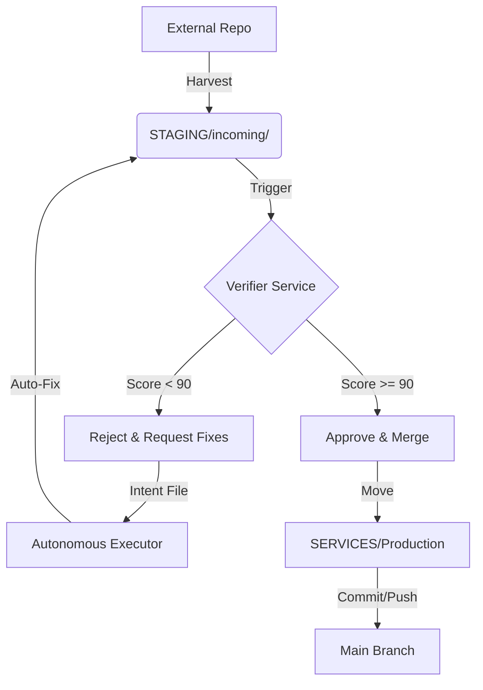

# 🛡️ GATEKEEPER - Optimized Verification Assembly Line

**Version:** 1.0
**Status:** PROPOSED
**Purpose:** Integrate Harvesting, Verification, and Review into a sovereign, automated Gatekeeper system.

---

## 🎯 The Objective
Transform the current **"Trust then Verify"** model (harvest -> commit -> verify later) into a **"Verify then Trust"** model (harvest -> quarantine -> verify -> commit).

This enables **Parallel Development** ("many people working at once") while maintaining **Sovereign Control** ("only bringing in best builds").

## 🏗️ System Architecture

### 1. The Staging Area (Quarantine)
Instead of merging harvested code directly into `SERVICES/` or `main`, we introduce a Staging Zone.
- **Path:** `STAGING/incoming/`
- **Role:** A temporary workspace for untrusted code.
- **Mechanism:** `harvest_repo.py` modified to target this path first.

### 2. The Gatekeeper (Logic Engine)
A new orchestration tool (`orchestration/tools/gatekeeper.py`) that manages the flow.
- **Input:** A harvest request (URL, branch).
- **Process:**
    1.  **Fetch:** Pull code to `STAGING/incoming/{repo_name}`.
    2.  **Analyze:** Trigger `SERVICES/verifier` on this path.
    3.  **Decide:** Compare score vs Threshold (e.g., 90%).
    4.  **Act:**
        *   **PASS:** Move to `SERVICES/`, Git Commit, Git Push.
        *   **FAIL:** Generate `FIX_REPORT.md`, create `docs/coordination/intents/fix-{repo}.json`.

### 3. The Fix Loop (Apprentice Integration)
When a harvest fails verification:
- The Gatekeeper creates a job for the **Autonomous Executor** (or a human).
- **Job:** "Fix issues in `STAGING/incoming/{repo_name}` based on `FIX_REPORT.md`."
- **Loop:** Once fixed, the Gatekeeper re-verifies.

---

## 🔄 The Optimized Workflow



## 🛠️ Components & Changes

### 1. `harvest_safe.py` (New Wrapper)
Wraps the existing `harvest_repo.py` but forces the target to be `STAGING/`.
Removes the "auto-push" behavior.

### 2. `gatekeeper.py` (The Brain)
```python
def process_harvest(repo_name):
    # 1. Call Verifier
    score = verifier.check(f"STAGING/{repo_name}")
    
    # 2. Decision
    if score.passing:
        promote_to_production(repo_name)
    else:
        dispatch_fix_mission(repo_name, score.issues)
```

### 3. `SERVICES/verifier` (Existing)
Already capable of scanning a path. Needs no major changes, just utilization.

---

## ⚡ Benefits

1.  **Parallelism:** 10 different features can be harvested simultaneously into `STAGING/`. They don't block each other.
2.  **Quality:** Zero bad code enters the `main` branch or `SERVICES/` directory.
3.  **Autonomy:** The system self-corrects. If a harvest is 80% good, the Autonomous Executor fixes the last 20% before you even see it.
4.  **Sovereignty:** You define the `CONSTITUTION.md` and `VERIFICATION_PROTOCOL.md`. Nothing enters unless it aligns.

## 🚀 Next Steps (Implementation)

1.  Create `STAGING/` directory structure.
2.  Create `orchestration/tools/gatekeeper.py`.
3.  Test with a sample repository.

