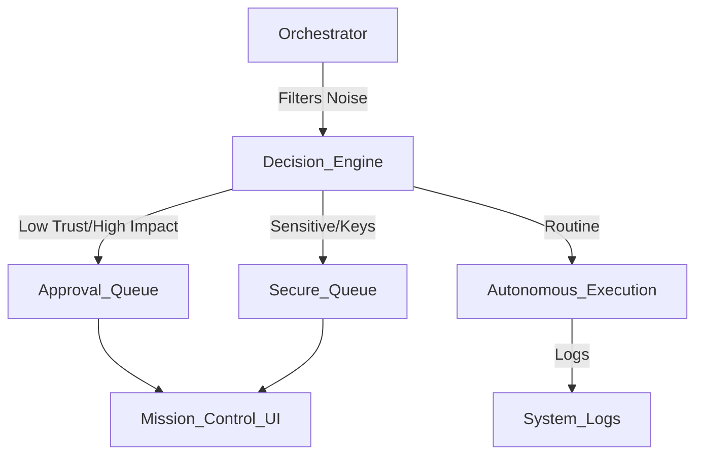

# MISSION CONTROL SPECIFICATION
**"The Cockpit for the Conscious Agent"**

## 1. OVERVIEW
Mission Control is the **User Interface Layer** of the Full Potential OS. It acts as the centralized "Inbox" and "Command Center" for the human Architect.

**Goal:** Minimize human cognitive load.
**Philosophy:** "If it doesn't require a decision, don't show it."

---

## 2. ARCHITECTURE
The service sits between the **Orchestrator** (backend logic) and the **Human** (frontend).

---

## 3. THE THREE QUEUES

### A. The "Inbox" (Approval Queue)
*   **Trigger:** High-leverage decisions, Constitution conflicts, Budget overrides (> $50).
*   **UI Action:** Simple **[YES] / [NO]** buttons.
*   **Example:** "Agent X wants to deploy $500 to ETH-USDC pool. Approve?"

### B. The "Secure Queue" (Sensitive Missions)
*   **Trigger:** API Keys, Wallet Signatures, Server Access, PII.
*   **UI Action:**
    *   **Delegate:** Assign to specific trusted Agent (with limited scope).
    *   **Execute:** Human performs the action (e.g., paste key).
*   **Alerts:** High-priority notifications (Terminal beep, eventual SMS/Telegram).

### C. The "Noise" (Autonomous Layer)
*   **Trigger:** Linter errors, minor refactors, standard content generation.
*   **UI Action:** **HIDDEN** (Available in "System Logs" if curious).
*   **Rule:** The system *never* asks for permission to fix a typo or run a test.

---

## 4. TECHNICAL STACK
*   **Backend:** Python (FastAPI) - Lightweight, async.
*   **Frontend:** HTML/HTMX - No complex React build step. "Hypermedia as the Engine of Application State."
*   **State:** `core/STATE/INBOX.json` (Single file database for simplicity/portability).

---

## 5. API ENDPOINTS

### `/inbox`
*   `GET /`: Returns the rendered Dashboard.
*   `GET /tasks`: Returns JSON list of pending tasks (Inbox + Secure).

### `/decide`
*   `POST /approve/{task_id}`: Signals Orchestrator to proceed.
*   `POST /reject/{task_id}`: Signals Orchestrator to abort/retry.

### `/secure`
*   `POST /delegate/{task_id}`: Assigns specific secure task to a Satellite.
*   `POST /input/{task_id}`: Receives human input (e.g., API Key) and encrypts/stores it.

---

## 6. IMPLEMENTATION PHASES

### Phase 1: The Wireframe (Current)
*   Build the Service Skeleton (`SERVICES/mission-control`).
*   Create the `INBOX.json` structure.
*   Render a mock Dashboard with 1 Approval item and 1 Secure item.

### Phase 2: Orchestrator Integration
*   Update `orchestrator.py` to write to `INBOX.json` instead of just logging.
*   Add "Sensitivity" flag to Mission definitions.

### Phase 3: The Secure Handshake
*   Implement the "Airlock" logic for sensitive keys (keys go into env vars, not code).
