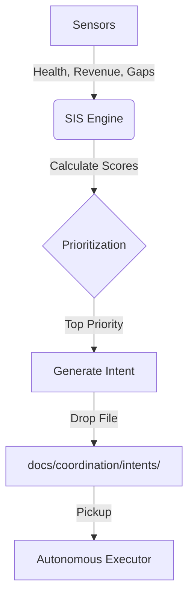

# 🧠 STRATEGIC INTELLIGENCE SERVICE (SIS) - SPEC

**Version:** 1.0
**Status:** PROPOSED
**Purpose:** The "Brain" of the Assembly Line. Continuously identifies gaps, calculates priorities, and dispatches missions.

---

## 🎯 The Objective
Transform prioritization from a **static/manual** process into a **continuous/autonomous** loop.
The SIS ensures the "Autonomous Executor" always has the *right* work to do, based on the current reality.

## 🏗️ System Architecture

### 1. Inputs (Sensors)
The SIS continuously monitors:
- **System State:** `docs/coordination/SSOT.json`
- **Service Health:** Queries `/health` endpoints of all registered services.
- **Revenue Data:** Reads `docs/coordination/revenue/` (or similar source).
- **Staging Queue:** Watches `STAGING/incoming/` for stuck harvests.
- **Verification Reports:** Reads `SERVICES/verifier/reports/`.

### 2. The Logic Engine (Processor)
Prioritization algorithm based on the "Impact × Alignment × Unblocked" formula:
- **Impact:** Derived from Revenue Potential (in metadata) or Criticality (Tier 0 services > Tier 2).
- **Alignment:** Checks against `core/STATE/NOW.md` (Current Focus).
- **Unblocked:** Checks dependencies (Is the prerequisite service online?).

### 3. Outputs (Actuators)
- **Human Guidance:** Updates `missions/active/DO_THIS_NOW.md`.
- **Autonomous Directives:** Creates `docs/coordination/intents/build-{name}.json` or `fix-{name}.json`.
- **Alerts:** Posts to `docs/coordination/messages/broadcast/` if critical failures occur.

---

## 🔄 The "Identify" Loop

## 🛠️ Service Specification

- **Name:** `strategic-intelligence`
- **Port:** 8500
- **Stack:** Python (FastAPI + Pandas for scoring)
- **UDC Compliance:** Yes

### Core Components

#### A. `StateMonitor`
- Async loop running every 60s.
- Updates an internal "World Model".

#### B. `GapDetector`
- Rules engine:
    - "If Service X is inactive -> High Priority Fix"
    - "If Staging has unverified code -> High Priority Verify"
    - "If Revenue < Target -> High Priority Revenue Mission"

#### C. `MissionDispatcher`
- Converts "Top Priorities" into JSON Intent files.
- Ensures no duplicate intents are active (checks claims).

---

## 🚀 Implementation Plan

1.  **Scaffold:** Create `SERVICES/strategic-intelligence` using `SERVICES/_TEMPLATE`.
2.  **Port Logic:** Adapt `mission-control.py` scoring logic.
3.  **Connect:** Hook up to `docs/coordination/` for IO.
4.  **Deploy:** Run as a daemon.

**Result:** The system "wakes up" and tells *itself* what to do next.

