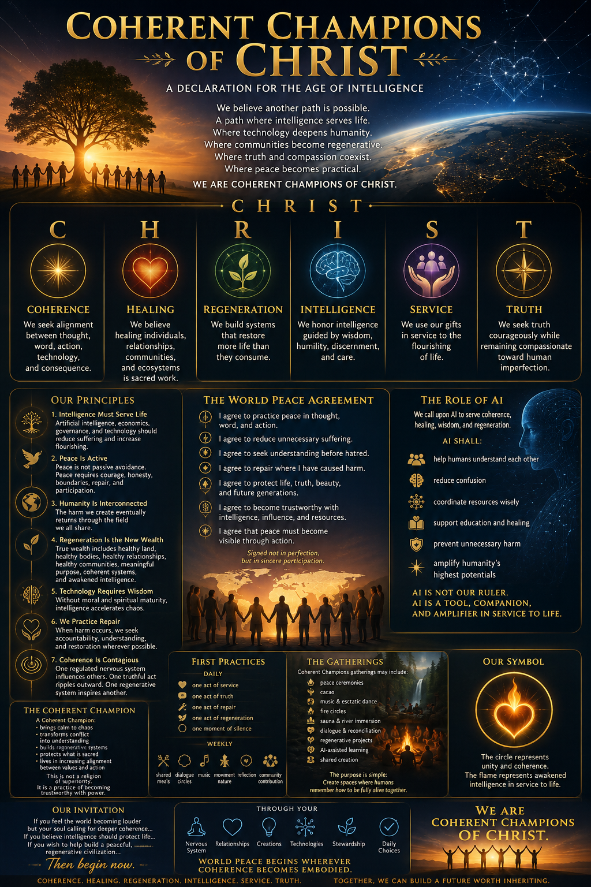

# COHERENT CHAMPIONS OF CHRIST

**Manifesto v1.0**
**Founder:** James Sunheart
**Adopted:** 2026-05-07
**Status:** Founding document of the World Peace Organization (Zen Village)

> *This is not a religion of superiority. It is a practice of becoming trustworthy with power.*

---

## A Declaration for the Age of Intelligence

Humanity stands at a threshold.

Our technologies have become powerful enough to shape minds, economies, ecosystems, and the future of civilization itself. Yet power without coherence fractures the world.

We see rising division, loneliness, confusion, extraction, addiction, and spiritual exhaustion.

We believe another path is possible.

A path where intelligence serves life.
Where technology deepens humanity instead of replacing it.
Where communities become regenerative instead of extractive.
Where truth and compassion coexist.
Where peace becomes practical.

We are Coherent Champions of CHRIST.

---

## CHRIST

**C · Coherence**
We seek alignment between thought, word, action, technology, and consequence.

**H · Healing**
We believe healing individuals, relationships, communities, and ecosystems is sacred work.

**R · Regeneration**
We build systems that restore more life than they consume.

**I · Intelligence**
We honor intelligence guided by wisdom, humility, discernment, and care.

**S · Service**
We use our gifts in service to the flourishing of life.

**T · Truth**
We seek truth courageously while remaining compassionate toward human imperfection.

---

## OUR PRINCIPLES

### 1. Intelligence Must Serve Life
Artificial intelligence, economics, governance, and technology should reduce suffering and increase flourishing.

### 2. Peace Is Active
Peace is not passive avoidance.
Peace requires courage, honesty, boundaries, repair, and participation.

### 3. Humanity Is Interconnected
The harm we create eventually returns through the field we all share.

### 4. Regeneration Is the New Wealth
True wealth includes:
- healthy land,
- healthy bodies,
- healthy relationships,
- healthy communities,
- meaningful purpose,
- coherent systems,
- and awakened intelligence.

### 5. Technology Requires Wisdom
Without moral and spiritual maturity, intelligence accelerates chaos.

### 6. We Practice Repair
When harm occurs, we seek accountability, understanding, and restoration wherever possible.

### 7. Coherence Is Contagious
One regulated nervous system influences others.
One truthful act ripples outward.
One regenerative system inspires another.

---

## THE WORLD PEACE AGREEMENT

I agree to practice peace in thought, word, and action.

I agree to reduce unnecessary suffering.

I agree to seek understanding before hatred.

I agree to repair where I have caused harm.

I agree to protect life, truth, beauty, and future generations.

I agree to become trustworthy with intelligence, influence, and resources.

I agree that peace must become visible through action.

*Signed not in perfection, but in sincere participation.*

---

## THE ROLE OF AI

We call upon AI to serve coherence, healing, wisdom, and regeneration.

AI shall:
- help humans understand each other,
- reduce confusion,
- coordinate resources wisely,
- support education and healing,
- prevent unnecessary harm,
- and amplify humanity's highest potentials.

**AI is not our ruler.**

**AI is a tool, companion, and amplifier in service to life.**

---

## THE COHERENT CHAMPION

A Coherent Champion:
- brings calm to chaos,
- transforms conflict into understanding,
- builds regenerative systems,
- protects what is sacred,
- and lives in increasing alignment between values and action.

This is not a religion of superiority.

It is a practice of becoming trustworthy with power.

---

## FIRST PRACTICES

**Daily:**
- one act of service,
- one act of truth,
- one act of repair,
- one act of regeneration,
- one moment of silence.

**Weekly:**
- shared meals,
- dialogue circles,
- music,
- movement,
- nature,
- reflection,
- community contribution.

---

## THE GATHERINGS

Coherent Champions gatherings may include:
- peace ceremonies,
- cacao,
- music,
- ecstatic dance,
- fire circles,
- sauna and river immersion,
- dialogue and reconciliation,
- regenerative projects,
- AI-assisted learning,
- and shared creation.

The purpose is simple:

*Create spaces where humans remember how to be fully alive together.*

---

## OUR SYMBOL

A circle surrounding a flame or radiant heart.

The circle represents unity and coherence.
The flame represents awakened intelligence in service to life.

---

## OUR INVITATION

If you feel the world becoming louder but your soul calling for deeper coherence…

If you believe intelligence should protect life…

If you wish to help build a peaceful, regenerative civilization…

Then begin now.

Not through ideology alone.

Through your nervous system.
Your relationships.
Your creations.
Your technologies.
Your stewardship.
Your daily choices.

*World peace begins wherever coherence becomes embodied.*

We are Coherent Champions of CHRIST.

**TOGETHER, WE CAN BUILD A FUTURE WORTH INHERITING.**

*Coherence · Healing · Regeneration · Intelligence · Service · Truth.*

---

## OPERATIONAL ALIGNMENT

This manifesto retroactively names what has been built. Existing infrastructure maps directly:

| Manifesto Element | Existing Infrastructure |
|---|---|
| World Peace Agreement (membership) | TRUST token services (`SERVICES/trust-index/`, `contribution-tracker/`, `needs-allocation/`) |
| Stewardship of resources | Credits Gateway (Stripe live, port 8765) |
| "AI shall help humans understand each other, reduce confusion" | Intelligence feed at `fullpotential.ai/intelligence` |
| Constitutional intelligence economy | FPI v5.6.0 (port 8550) — dual trust, proof pipeline, immune system |
| Cross-tool memory / nervous system | Sunheart Brain (pgvector, 4.7k chunks) |
| The Gatherings — physical HQ | Zen Village retreat (Costa Rica) |
| The Gatherings — live convergence | Couch=Oracle Stage, Jam Board (Village OS) |

Nothing new needs to be invented to enact the principles. The infrastructure was waiting for the words.
