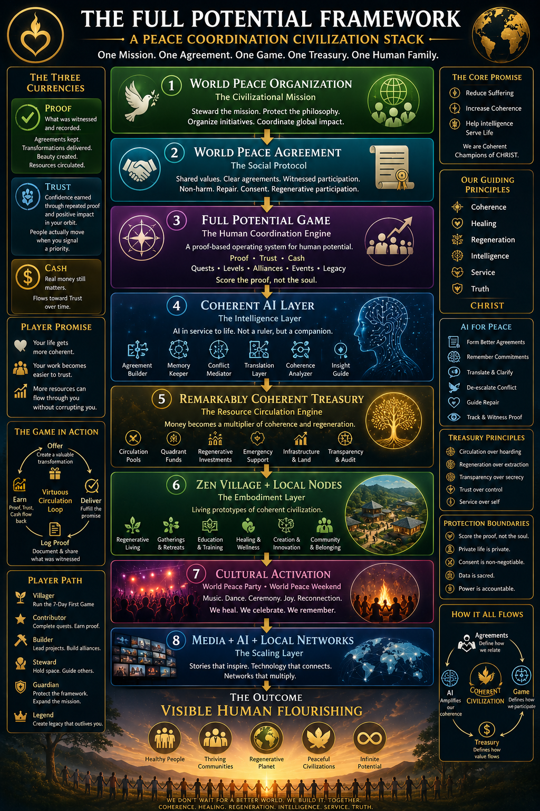

# 🌍 The Full Potential Framework

**A Peace Coordination Civilization Stack**

*ONE MISSION · ONE AGREEMENT · ONE GAME · ONE TREASURY · ONE HUMAN FAMILY*



The umbrella framework that integrates every layer the World Peace Organization operates on. Where the Manifesto is the **why** and the Ecosystem was the early **what**, this is the **complete coordination stack** — the eight layers, the side-channels (Currencies, Promises, Principles, AI Modules, Player Path, Protection Boundaries), and the closed loop they form.

> Companion documents:
> - **Why** — [`COHERENT_CHAMPIONS_MANIFESTO.md`](./COHERENT_CHAMPIONS_MANIFESTO.md) (CHRIST + 7 principles)
> - **Earlier ecosystem framing** — [`WORLD_PEACE_ECOSYSTEM.md`](./WORLD_PEACE_ECOSYSTEM.md) (subset; superseded by this doc as canonical)
> - **AI substrate** — [`WORLD_PEACE_AGREEMENTS_PROTOCOL.md`](./WORLD_PEACE_AGREEMENTS_PROTOCOL.md) (WPAP — operationalizes Layer 4)
> - **Player OS** — [`FULL_POTENTIAL_GAME.md`](./FULL_POTENTIAL_GAME.md) (operationalizes Layer 3)
> - **Economy** — [`REMARKABLY_COHERENT_TREASURY.md`](./REMARKABLY_COHERENT_TREASURY.md) (operationalizes Layer 5)

---

## The Core Promise

- **Reduce Suffering**
- **Increase Coherence**
- **Help intelligence Serve Life**

*We are Coherent Champions of CHRIST.*

## The Player Promise

If you play well, three things happen:

1. Your life gets more coherent.
2. Your work becomes easier to trust.
3. More resources can flow through you without corrupting you.

## Our Guiding Principles — CHRIST

- **C**oherence
- **H**ealing
- **R**egeneration
- **I**ntelligence
- **S**ervice
- **T**ruth

## Protection Boundaries (non-negotiable)

- Score the proof, **not the soul**.
- Private life is **private**.
- Consent is **non-negotiable**.
- Data is **sacred**.
- Power is **accountable**.

## Treasury Principles

- Circulation **over** hoarding.
- Regeneration **over** extraction.
- Transparency **over** secrecy.
- Trust **over** control.
- Service **over** self.

---

## The Three Currencies

| Currency | What it is |
|---|---|
| **Proof** | What was witnessed and recorded. Agreements kept, transformations delivered, beauty created, resources circulated. |
| **Trust** | Confidence earned through repeated proof and positive impact in your orbit. People actually move when you signal a priority. |
| **Cash** | Real money still matters. Flows toward Trust over time. |

See [`FULL_POTENTIAL_GAME.md`](./FULL_POTENTIAL_GAME.md) §5 and [`REMARKABLY_COHERENT_TREASURY.md`](./REMARKABLY_COHERENT_TREASURY.md) §6 for the technical mappings (Field Score → Proof, CPI → Trust).

---

## The Eight Layers

### 1. World Peace Organization — *The Civilizational Mission*

> *Steward the mission. Protect the philosophy. Organize initiatives. Coordinate global impact.*

The stewardship layer. Holds the canonical text, the chapters, the gatherings, the partnerships, the AI coordination, the regenerative projects, the community infrastructure.

---

### 2. World Peace Agreement — *The Social Protocol*

> *Shared values. Clear agreements. Witnessed participation.*

Non-Harm · Repair · Truth · Regeneration · Human Dignity · Service to Life.

This is what each Coherent Champion signs to enter. See [`WORLD_PEACE_AGREEMENT.md`](./WORLD_PEACE_AGREEMENT.md) for the canonical template, [`FORMING_AGREEMENTS.md`](./FORMING_AGREEMENTS.md) for the protocol, and [`AGREEMENTS/`](./AGREEMENTS/) for instances.

---

### 3. Full Potential Game — *The Human Coordination Engine*

> *A proof-based operating system for human potential. Score the proof, not the soul.*

**Currencies:** Proof · Trust · Cash
**Mechanics:** Quests · Levels · Alliances · Events · Legacy

The visible board on which players play. See [`FULL_POTENTIAL_GAME.md`](./FULL_POTENTIAL_GAME.md) for the v1.3 Player's Guide.

**The Game in Action — Virtuous Circulation Loop:**

```
        Offer  ←——————  Earn (Proof, Trust, Cash flow back)
          |                          ↑
          ↓                          |
       Deliver  →  Log Proof  →  Witness  →  ...
```

---

### 4. Coherent AI Layer — *The Intelligence Layer*

> *AI in service to life. Not a ruler, but a companion.*

Six AI modules (WPAP — see [`WORLD_PEACE_AGREEMENTS_PROTOCOL.md`](./WORLD_PEACE_AGREEMENTS_PROTOCOL.md)):

| Module | Function |
|---|---|
| 🕊 **Agreement Builder** | Form better agreements |
| 🧠 **Memory Keeper** | Remember commitments |
| ❤️ **Conflict Mediator** | De-escalate before things harden |
| 🌍 **Translation Layer** | Translate & clarify across cultures and emotional states |
| 📜 **Coherence Analyzer** | Detect ambiguity, imbalance, missing expectations |
| 👁 **Insight Guide** | Track & witness proof; surface patterns |

These modules turn Layer 3's player flow + Layer 5's economy into something operable at scale, while staying inside the Protection Boundaries.

---

### 5. Remarkably Coherent Treasury — *The Resource Circulation Engine*

> *Money becomes a multiplier of coherence and regeneration.*

Six concrete elements:

- **Circulation Pools** — where coherent value moves
- **Quadrant Funds** — bounded resource categories matched to needs
- **Regenerative Investments** — capital deployed for restoration, not extraction
- **Emergency Support** — mutual aid as designed feature, not afterthought
- **Infrastructure & Land** — long-horizon physical substrate (Zen Village et al.)
- **Transparency & Audit** — every flow legible to participants

See [`REMARKABLY_COHERENT_TREASURY.md`](./REMARKABLY_COHERENT_TREASURY.md) v0.10 for the full architectural spec — Two-Economy Model, Three-Layer Architecture, Circulation Equity Formula, Verification Escrow, Distance-Weighted Witness, Governance Firewall.

---

### 6. Zen Village + Local Nodes — *The Embodiment Layer*

> *Living prototypes of coherent civilization.*

- Regenerative Living
- Gatherings & Retreats
- Education & Training
- Healing & Wellness
- Creation & Innovation
- Community & Belonging

Zen Village (Costa Rica) is the canonical first node. Local Nodes elsewhere replicate the embodiment without copying the form — coherence transfers, geography varies.

---

### 7. Cultural Activation — *World Peace Party · World Peace Weekend*

> *Music. Dance. Ceremony. Joy. Reconnection. We heal. We celebrate. We remember.*

This layer is where the philosophy meets the body. Where strangers become participants. Where the Agreement stops being a document and starts being a felt sense in a room.

---

### 8. Media + AI + Local Networks — *The Scaling Layer*

> *Stories that inspire. Technology that connects. Networks that multiply.*

Films & Storytelling · Podcasts & Interviews · Music & Art · Transformation Stories · Viral Peace Content · Global Participation. Plus the AI infrastructure that makes Local Nodes recognize each other across geography.

---

## The Player Path

| Stage | What |
|---|---|
| 🌱 **Villager** | Run the 7-Day First Game |
| ⭐ **Contributor** | Complete quests. Earn proof. |
| 🏗 **Builder** | Lead projects. Build alliances. |
| 🛐 **Steward** | Hold space. Guide others. |
| 🛡 **Guardian** | Protect the framework. Expand the mission. |
| 👑 **Legend** | Create legacy that outlives you. |

You don't pick your stage. The stage picks you. Field response — how the network actually moves when you create direction — confirms readiness.

---

## How It All Flows

```
        Agreements
       (define how we relate)
              │
              ▼
   ┌──────────┼──────────┐
   ▼          ▼          ▼
   AI    Coherent     Game
(amplifies  Civilization (defines how we
coherence)              participate)
              │
              ▼
          Treasury
   (defines how value flows)
```

Each defines **a different vector of coordination**. None can carry the others alone. All four together produce the substrate.

---

## The Outcome — Visible Human Flourishing

- 🏥 **Healthy People**
- 🌳 **Thriving Communities**
- 🌍 **Regenerative Planet**
- 🕊 **Peaceful Civilizations**
- ∞ **Infinite Potential**

---

## The Closing Line

> **We don't wait for a better world. We build it. Together.**
>
> *Coherence. Healing. Regeneration. Intelligence. Service. Truth.*

---

## Where this fits

This document supersedes [`WORLD_PEACE_ECOSYSTEM.md`](./WORLD_PEACE_ECOSYSTEM.md) as the canonical framework view. The earlier ecosystem doc remains in the repo as a historical reference but should not be cited as the current architecture. New work references this file.

*Companion to the Manifesto. The complete coordination stack made visible.*
