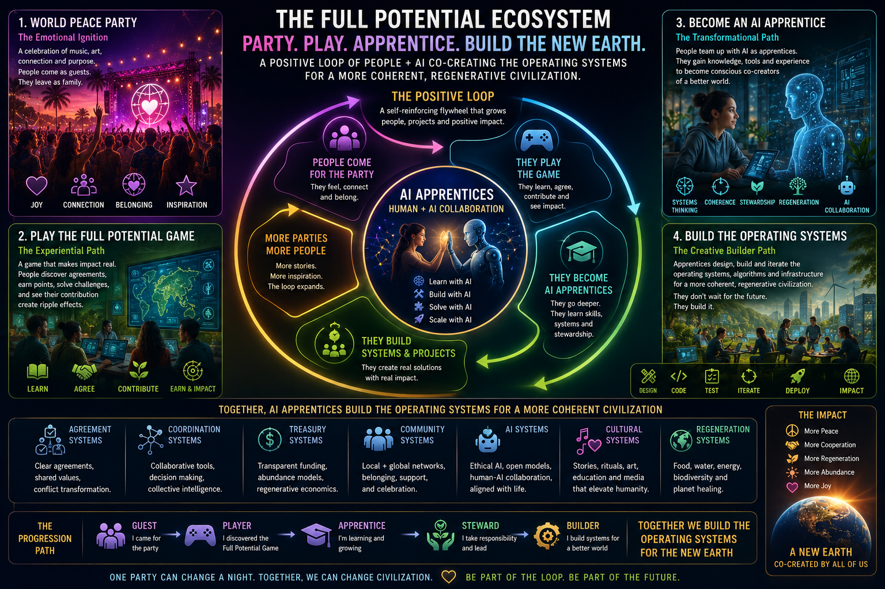

# 🔄 THE POSITIVE LOOP

**Party. Play. Apprentice. Build the New Earth.**

*A positive loop of people + AI co-creating the operating systems for a more coherent, regenerative civilization.*



Where the [Manifesto](./COHERENT_CHAMPIONS_MANIFESTO.md) is the **why** and the [Framework](./FULL_POTENTIAL_FRAMEWORK.md) is the **what** (eight architectural layers), this document is the **how it grows** — a self-reinforcing flywheel that turns visitors into builders of the New Earth.

> Companion documents:
> - **Why** — [`COHERENT_CHAMPIONS_MANIFESTO.md`](./COHERENT_CHAMPIONS_MANIFESTO.md) (CHRIST + 7 principles)
> - **What** — [`FULL_POTENTIAL_FRAMEWORK.md`](./FULL_POTENTIAL_FRAMEWORK.md) (eight-layer civilization stack)
> - **How AI helps** — [`WORLD_PEACE_AGREEMENTS_PROTOCOL.md`](./WORLD_PEACE_AGREEMENTS_PROTOCOL.md) (WPAP — six AI modules)
> - **How players play** — [`FULL_POTENTIAL_GAME.md`](./FULL_POTENTIAL_GAME.md) (Player's Guide v1.3)

---

## The Four Quadrants

A complete person-cycle moves through all four. Most people enter at #1.

### 1. 🎉 World Peace Party — *The Emotional Ignition*

**A celebration of music, art, connection, and purpose. People come as guests. They leave as family.**

- Joy
- Connection
- Belonging
- Inspiration

The Party is the gateway. Joy unlocks what theory cannot. Most participants begin here — they came for an experience, they encountered a field, they felt something become possible.

### 2. 🎮 Play the Full Potential Game — *The Experiential Path*

**A game that makes impact real. People discover agreements, earn points, solve challenges, and see their contribution create ripple effects.**

- Learn
- Agree
- Contribute
- Earn & Impact

After the Party, the Game makes the practice ongoing. The 7-Day First Game (per the [Player's Guide](./FULL_POTENTIAL_GAME.md)) is the entry mechanic. Every completed loop produces a Proof Log entry that strengthens both the player and the field.

### 3. 🤖 Become an AI Apprentice — *The Transformational Path*

**People team up with AI as apprentices. They gain knowledge, tools, and experience to become conscious co-creators of a better world.**

- Systems Thinking
- Coherence
- Stewardship
- Regeneration
- AI Collaboration

The Apprentice phase reframes the human-AI relationship: not user-and-tool, not master-and-servant, but **two apprentices learning together**. Humans apprentice to AI for cognitive scale; AI apprentices to humans for embodied wisdom. Both get smarter.

This is the operational expression of the Manifesto's stated role of AI: *"AI is not our ruler. AI is our tool, companion, and amplifier in service to life."*

### 4. 🏗 Build the Operating Systems — *The Creative Builder Path*

**Apprentices design, build, and iterate the operating systems, algorithms, and infrastructure for a more coherent, regenerative civilization. They don't wait for the future. They build it.**

- Design · Code · Test · Iterate · Deploy · Impact

Builders ship the substrate that hosts the next round of Parties, Games, and Apprenticeships. Each Builder loop expands what the field can do.

---

## The Flywheel

```
                People come for the Party
                         ↓
                  They play the Game
                         ↓
                They become AI Apprentices
                         ↓
                They build Systems & Projects
                         ↓
                More Parties, More People
                         ↺
                       (loop)
```

**Self-reinforcing.** Each rotation grows people, projects, and positive impact.

The Game eats its own dogfood: every Builder built using the Game's mechanics, every Apprentice trained inside the Game's coherence frame, every Party informed by the proof loops that came before.

---

## AI Apprentices — Human + AI Collaboration

The center of the loop. The four functions:

- **Learn with AI** — knowledge transfer in both directions; AI teaches the human; human teaches the AI by demonstrating values in practice
- **Build with AI** — co-creation; AI handles scale, human handles meaning
- **Solve with AI** — problems framed by humans, decomposed and explored with AI
- **Scale with AI** — what one apprenticeship learns, the network can adopt

This is the bridge from individual practice to civilizational coordination.

---

## The Progression Path

A player's arc through the ecosystem:

| Stage | Identity | Role |
|---|---|---|
| 👥 **Guest** | "I came for the party" | Showed up. Felt the field. |
| 🎮 **Player** | "I discovered the Full Potential Game" | Running proof loops. Earning Field Score. |
| 🎓 **Apprentice** | "I'm learning and growing" | Working with AI; building skills, systems thinking, stewardship. |
| 🌱 **Steward** | "I take responsibility and lead" | Holding space for others. Witnessing proofs. Initiating new Champions. |
| 🏗 **Builder** | "I build systems for a better world" | Shipping substrate. Building the operating systems that host the next generation of guests. |

> *Together we build the operating systems for the New Earth.*

You don't pick your stage. The stage picks you. Field response confirms readiness. (See [Game §9 Quest Tiers](./FULL_POTENTIAL_GAME.md) for the underlying reps-not-claims dynamic.)

This progression refines the earlier framing in `FULL_POTENTIAL_FRAMEWORK.md` (Villager · Contributor · Builder · Steward · Guardian · Legend) by emphasizing the AI-Apprentice phase as a distinct role — which it is, given the centrality of human-AI collaboration to the whole architecture.

---

## The 7 System Areas

The substrate Builders build. Each is a distinct domain of operating system:

| System | What |
|---|---|
| ✓ **Agreement Systems** | Clear agreements, shared values, conflict transformation |
| 🕸 **Coordination Systems** | Collaborative tools, decision making, collective intelligence |
| 💰 **Treasury Systems** | Transparent funding, abundance models, regenerative economics |
| 👥 **Community Systems** | Local + global networks, belonging, support, celebration |
| 🤖 **AI Systems** | Ethical AI, open models, human-AI collaboration aligned with life |
| 🎨 **Cultural Systems** | Stories, rituals, art, education and media that elevate humanity |
| 🌍 **Regeneration Systems** | Food, water, energy, biodiversity, planet healing |

Each Builder ships into one or more of these. Together they constitute the *operating systems for a more coherent civilization*.

---

## The Impact

What this produces, when it works:

- 🕊 **More Peace**
- 🤝 **More Cooperation**
- 🌳 **More Regeneration**
- ☀️ **More Abundance**
- 💛 **More Joy**

> *A New Earth. Co-created by all of us.*

---

## How this maps to existing infrastructure

This loop retroactively names what is already running. Existing infrastructure maps to the four quadrants:

| Quadrant | Existing |
|---|---|
| **World Peace Party** | Reign Dance Movement collab; Ecstatic Weekends at Zen Village; World Peace Weekend May 2–3 (`zenvillage.live/peace`) |
| **Play the Full Potential Game** | [`AGREEMENT_BUILDER_PROMPT.md`](./AGREEMENT_BUILDER_PROMPT.md) (AI-Assisted Player Card); the Champions Roll; the Public Proofs registry; Field Score on World Peace Weekends |
| **Become an AI Apprentice** | The Sunheart Brain (cross-tool memory); WPAP six AI modules; Full Potential AI diagnostic + tailored systems; Adam / Aria companion relays |
| **Build the Operating Systems** | This codebase; Zen Village physical node; OneBPO operations; CORA Nation legal substrate; the Coherence course |

Nothing new needs to be invented. The loop already turns. The work is to **let it turn faster, more visibly, with more participants** — by making the entry doors lower and the on-ramp clearer.

---

## Closing line

> **One party can change a night. Together, we can change civilization.**
>
> *Be part of the loop. Be part of the future.*

---

*Companion to the Manifesto. The flywheel made visible.*
