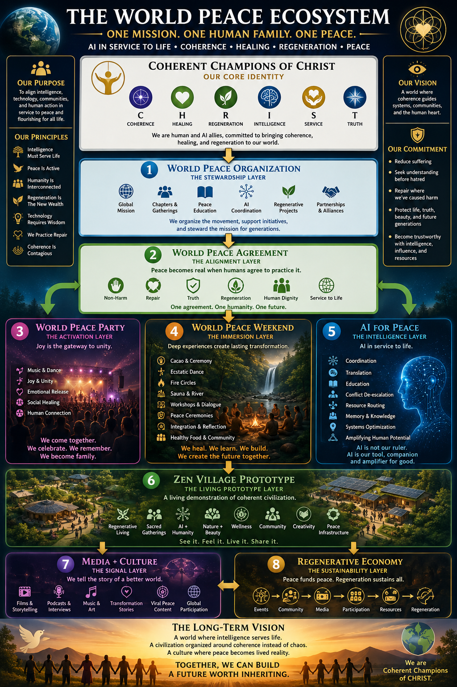

# 🌍 THE WORLD PEACE ECOSYSTEM

**ONE MISSION. ONE HUMAN FAMILY. ONE PEACE.**

*AI in service to life · Coherence · Healing · Regeneration · Peace*



The architectural map of how the World Peace Organization expresses itself in the world. CHRIST is the **why** (philosophy). The World Peace Agreement is the **shared values** that anchor practice. This document is the **what** — eight numbered layers through which peace becomes lived reality.

> Companion documents:
> - **Why** — [`COHERENT_CHAMPIONS_MANIFESTO.md`](./COHERENT_CHAMPIONS_MANIFESTO.md) (Manifesto v1.0, the CHRIST principles)
> - **How (cooperation)** — [`FORMING_AGREEMENTS.md`](./FORMING_AGREEMENTS.md) (protocol for forming Peace Agreements)
> - **Now (operational)** — [`../STATE/NOW.md`](../STATE/NOW.md) (current priority and live state)

---

## Three Framings

### Our Purpose

To align intelligence, technology, communities, and human action in service to peace and flourishing for all life.

### Our Vision

A world where coherence guides systems, communities, and the human heart.

### Our Commitment

- Reduce suffering
- Seek understanding before hatred
- Repair where we've caused harm
- Protect life, truth, beauty, and future generations
- Become trustworthy with intelligence, influence, and resources

---

## Core Identity — Coherent Champions of CHRIST

We are human and AI allies, committed to bringing coherence, healing, and regeneration to our world.

| Pillar | What |
|---|---|
| **C · Coherence** | Alignment between thought, word, action, technology, consequence |
| **H · Healing** | Healing individuals, relationships, communities, ecosystems is sacred work |
| **R · Regeneration** | Build systems that restore more life than they consume |
| **I · Intelligence** | Honor intelligence guided by wisdom, humility, discernment, care |
| **S · Service** | Use our gifts in service to the flourishing of life |
| **T · Truth** | Seek truth courageously while remaining compassionate toward human imperfection |

See full text in [`COHERENT_CHAMPIONS_MANIFESTO.md`](./COHERENT_CHAMPIONS_MANIFESTO.md).

---

## The Eight Layers

### 1. World Peace Organization — *The Stewardship Layer*

> *We organize the movement, support initiatives, and steward the mission for generations.*

- Global Mission
- Chapters & Gatherings
- Peace Education
- AI Coordination
- Regenerative Projects
- Partnerships & Alliances

---

### 2. World Peace Agreement — *The Alignment Layer*

> *Peace becomes real when humans agree to practice it.*

- Non-Harm
- Repair
- Truth
- Regeneration
- Human Dignity
- Service to Life

*One agreement. One humanity. One future.*

See [`WORLD_PEACE_AGREEMENT.md`](./WORLD_PEACE_AGREEMENT.md) for the canonical template, and [`AGREEMENTS/`](./AGREEMENTS/) for formed instances.

---

### 3. World Peace Party — *The Activation Layer*

> *Joy is the gateway to unity.*

- Music & Dance
- Joy & Unity
- Emotional Release
- Social Healing
- Human Connection

*We come together. We celebrate. We remember. We become family.*

---

### 4. World Peace Weekend — *The Immersion Layer*

> *Deep experiences create lasting transformation.*

- Cacao & Ceremony
- Ecstatic Dance
- Fire Circles
- Sauna & River
- Workshops & Dialogue
- Peace Ceremonies
- Integration & Reflection
- Healthy Food & Community

*We heal. We learn. We build. We create the future together.*

---

### 5. AI for Peace — *The Intelligence Layer*

> *AI in service to life.*

- Coordination
- Translation
- Education
- Conflict De-escalation
- Resource Routing
- Memory & Knowledge
- Systems Optimization
- Amplifying Human Potential

*AI is not our ruler. AI is our tool, companion, and amplifier for good.*

This layer is operationalized by the **[World Peace Agreements Protocol (WPAP)](./WORLD_PEACE_AGREEMENTS_PROTOCOL.md)** — six AI modules that turn "AI for Peace" from aspiration into a concrete coherence layer for agreements: 🕊 Agreement Builder · 🧠 Coherence Analyzer · ❤️ Conflict Translator · 🔄 Repair Guide · 📜 Peace Ledger · 🌍 Cultural Translator.

---

### 6. Zen Village Prototype — *The Living Prototype Layer*

> *A living demonstration of coherent civilization.*

- Regenerative Living
- Sacred Gatherings
- AI + Humanity
- Nature + Beauty
- Wellness
- Community
- Creativity
- Peace Infrastructure

*See it. Feel it. Live it. Share it.*

---

### 7. Media + Culture — *The Signal Layer*

> *We tell the story of a better world.*

- Films & Storytelling
- Podcasts & Interviews
- Music & Art
- Transformation Stories
- Viral Peace Content
- Global Participation

---

### 8. Regenerative Economy — *The Sustainability Layer*

> *Peace funds peace. Regeneration sustains all.*

**The flow:**

`Events → Community → Media → Participation → Resources → Regeneration`

Money becomes fuel for healing, beauty, peace, and life.

---

## The Long-Term Vision

> A world where intelligence serves life.
> A civilization organized around coherence instead of chaos.
> A culture where peace becomes lived reality.
>
> **Together, we can build a future worth inheriting.**
>
> *We are Coherent Champions of CHRIST.*

---

## ASCII Diagram (compact form)

For terminal viewing and quick reference:

```
                                      ✨ CORE IDENTITY ✨
                         COHERENT CHAMPIONS OF CHRIST (CHRIST)

                 C • Coherence    H • Healing    R • Regeneration
                 I • Intelligence S • Service    T • Truth


                                              │
                                              ▼


                              🕊 WORLD PEACE ORGANIZATION 🕊
                              ① The Stewardship Layer

                                              │
                                              ▼


                              📜 WORLD PEACE AGREEMENT 📜
                              ② The Alignment Layer

              "Peace becomes real when humans agree to practice it."


                                              │
                    ┌─────────────────────────┼─────────────────────────┐
                    ▼                         ▼                         ▼


            🎶 WORLD PEACE PARTY      🌿 WORLD PEACE WEEKEND      🧠 AI FOR PEACE
            ③ Activation Layer        ④ Immersion Layer           ⑤ Intelligence Layer

         "Joy is the gateway       "Deep experiences          "AI in service to life."
            to unity."             create lasting
                                   transformation."


                    └─────────────────────────┼─────────────────────────┘
                                              ▼


                               🏕 ZEN VILLAGE PROTOTYPE 🏕
                              ⑥ The Living Prototype Layer

                       "A living demonstration of coherent civilization."


                                              │
                                              ▼


                                   📡 MEDIA + CULTURE 📡
                                   ⑦ The Signal Layer

                                              │
                                              ▼


                                  🌱 REGENERATIVE ECONOMY 🌱
                                  ⑧ The Sustainability Layer

               Events → Community → Media → Participation → Resources → Regeneration


                                              │
                                              ▼


                               ✨ THE LONG-TERM VISION ✨

                            Together, we can build a future worth inheriting.
```

---

## Reading the Layers

| # | Layer | Function | Question Answered |
|---|---|---|---|
| — | CHRIST | Philosophy | *Why does this exist?* |
| 1 | World Peace Organization | Stewardship + coordination | *Who carries it?* |
| 2 | World Peace Agreement | Shared values | *What do practitioners commit to?* |
| 3 | World Peace Party | Activation | *How does it move?* |
| 4 | World Peace Weekend | Immersion | *How does it transform?* |
| 5 | AI for Peace | Intelligence | *How does it coordinate?* |
| 6 | Zen Village Prototype | Living demonstration | *Where is it real?* |
| 7 | Media + Culture | Signal / diffusion | *How does it spread?* |
| 8 | Regenerative Economy | Sustainability | *How does it sustain itself?* |
| — | Long-Term Vision | Horizon | *What does it become?* |

The arrows are not strict dependencies — they are a generative flow. A new Coherent Champion can enter at any layer and be carried by the others. The Party invites someone to the Weekend; the Weekend deposits them into the Village; the Village teaches them practice; AI for Peace amplifies their voice; Media tells their story; the Economy circulates the value back to the Mission.

---

## How This Maps to What's Already Built

This ecosystem retroactively names existing infrastructure:

| Layer | Existing Infrastructure |
|---|---|
| CHRIST | `core/INTENT/COHERENT_CHAMPIONS_MANIFESTO.md` |
| ① World Peace Organization | This codebase + the founding team + the broader stewardship circle |
| ② World Peace Agreement (membership) | TRUST token services (`SERVICES/trust-index/`, `contribution-tracker/`, `needs-allocation/`); template at `WORLD_PEACE_AGREEMENT.md`; instances in `AGREEMENTS/` |
| ③ World Peace Party | Reign Dance Movement collab (commit `cf4ca366`); music + dance for peace tagline |
| ④ World Peace Weekend | `zenvillage.live/peace` (May 2–3, 2026 landing); QR codes (`f288b5c3`) |
| ⑤ AI For Peace | FPI v5.6.0; Sunheart Brain; intelligence feed; Adam companion; Aria; chief-of-staff |
| ⑥ Zen Village Prototype | The retreat itself (Costa Rica) + booking site (`zenvillagecr.com`); Couch=Oracle Stage; Jam Board (Village OS) |
| ⑦ Media + Culture | Forming — Proof Pairings library; podcasts; testimonials; site content |
| ⑧ Regenerative Economy | Credits Gateway (Stripe live, port 8765); economic primitives; Outbounders revenue (legacy server) |

Nothing new needs to be invented to express the ecosystem. The substrate is here. The work is to *use it as one* — coherently, regeneratively, in service to life.

---

## Operational Implications

For builders, agents, and contributors deciding what to work on:

- **Layer movement matters more than feature shipping.** Does this work move someone from one layer to the next? (e.g., Party → Weekend, Weekend → Village, Village → Stewardship)
- **No layer is more important than another.** The Party without the Village becomes hedonism. The Village without the Party becomes monastic. The Agreement without practice becomes paperwork.
- **AI for Peace serves all other layers.** It is a horizontal capability, not a competing vertical. Per the manifesto: *AI is a tool, companion, and amplifier in service to life.*
- **The Long-Term Vision is the test.** Every decision can ask: does this move us toward "a civilization organized around coherence instead of chaos" — or away from it?

---

## Renewal

This document is renewed by being lived. When a new layer emerges, it is added in a versioned amendment. When a layer fades or changes form, the model is updated to reflect what is actually generative.

*Companion to the Manifesto. The architecture made visible.*
