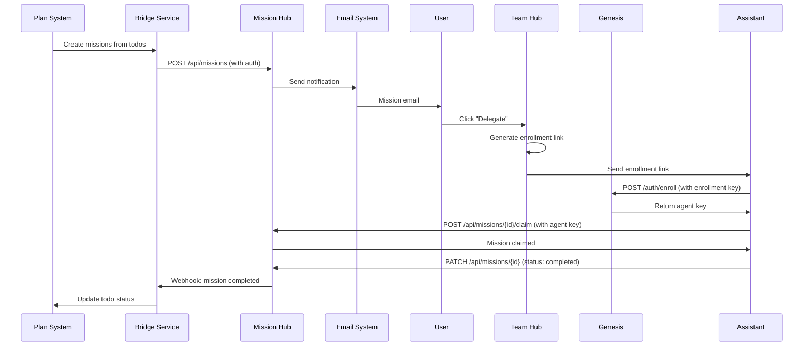

# Genesis & Mission Hub Integration Flow

## Architecture Overview

```mermaid
graph TB
    subgraph "Plan Layer"
        Plan[Plan System<br/>mcp_create_plan]
        Todos[Plan Todos]
    end
    
    subgraph "Bridge Layer"
        Bridge[Plan-to-Mission Bridge<br/>Port TBD]
    end
    
    subgraph "Mission Layer"
        MissionHub[Mission Hub<br/>Port 8700]
        Missions[Missions API<br/>/api/missions]
    end
    
    subgraph "Notification Layer"
        CortexMail[Cortex Mail<br/>Port 8860]
        Email[james@fullpotential.com]
    end
    
    subgraph "Delegation Layer"
        TeamHub[Team Hub<br/>Port 8355]
        EnrollLink[Enrollment Link<br/>Generator]
    end
    
    subgraph "Auth Layer"
        Genesis[Genesis<br/>Port 8150]
        AgentKey[Agent Keys<br/>agent-{uuid}]
    end
    
    Plan --> Todos
    Todos --> Bridge
    Bridge --> MissionHub
    MissionHub --> Missions
    Missions --> CortexMail
    CortexMail --> Email
    Email --> TeamHub
    TeamHub --> EnrollLink
    EnrollLink --> Genesis
    Genesis --> AgentKey
    AgentKey --> Missions
    
    style Plan fill:#a855f7
    style MissionHub fill:#3b82f6
    style Genesis fill:#10b981
    style TeamHub fill:#f59e0b
```

## Data Flow

### 1. Plan Creation → Mission Creation
```
Plan Todo → Bridge Service → Mission Hub API → Mission Created
```

**Data Transformation:**
```json
// Input: Plan Todo
{
  "id": "st-george-venue-research",
  "content": "Research and contact St. George Opera House...",
  "status": "pending"
}

// Output: Mission Hub Mission
{
  "id": "M-PLAN-001",
  "title": "Contact St. George Opera House",
  "description": "Research and contact...",
  "type": "human_only",
  "priority": "high",
  "plan_id": "connective-events-plan",
  "todo_id": "st-george-venue-research"
}
```

### 2. Mission Created → Email Notification
```
Mission Hub → Email Module → Cortex Mail → Email Sent
```

**Email Content:**
- Mission title and description
- Action buttons: Delegate | Claim | Complete
- Secure delegation link
- Mission ID for tracking

### 3. Delegation → Enrollment
```
Email "Delegate" → Team Hub → Generate Link → Assistant → Genesis Enrollment
```

**Enrollment Link Format:**
```
https://team-hub.fullpotential.ai/enroll/{encrypted-token}
```

**Token Contains:**
- Encrypted enrollment key: `enroll-1c77b8ce63c4`
- Mission ID (optional)
- Expiration timestamp

### 4. Enrollment → Agent Key
```
Assistant Clicks Link → Genesis /auth/enroll → Agent Key Generated
```

**Response:**
```json
{
  "agent_key": "agent-550e8400-e29b-41d4-a716-446655440000",
  "agent_name": "assistant-name",
  "universe_map": {...}
}
```

### 5. Mission Claim → Completion
```
Agent Key → Mission Hub /api/missions/{id}/claim → Work → Complete → Status Sync
```

## API Endpoints

### Plan-to-Mission Bridge
- `POST /api/plans/{plan_id}/create-missions` - Convert todos to missions
- `GET /api/plans/{plan_id}/missions` - List missions for plan
- `POST /api/missions/{id}/sync-status` - Sync status back to plan

### Mission Hub (Existing)
- `GET /api/missions` - List all missions
- `POST /api/missions` - Create mission
- `PATCH /api/missions/{id}` - Update mission
- `POST /api/missions/{id}/claim` - Claim mission (requires agent key)

### Team Hub (Enhancement)
- `POST /api/genesis/enrollment-link` - Generate enrollment link
- `GET /api/genesis/enroll/{token}` - Process enrollment
- `POST /api/genesis/generate-key` - Generate agent key (existing)

### Genesis (Existing)
- `POST /auth/enroll` - Enroll agent with enrollment key
- `POST /auth/agent` - Authenticate with agent key
- `POST /admin/generate-key` - Generate agent key
- `GET /registry/agents` - List agents

## Security Flow



## Implementation Checklist

- [ ] Create plan-to-mission bridge service
- [ ] Add enrollment link generator to Team Hub
- [ ] Add email notification module to Mission Hub
- [ ] Create email templates with action buttons
- [ ] Add webhook endpoints for email actions
- [ ] Implement status sync between plans and missions
- [ ] Test end-to-end delegation flow
- [ ] Add monitoring and logging
- [ ] Create admin dashboard for mission oversight


