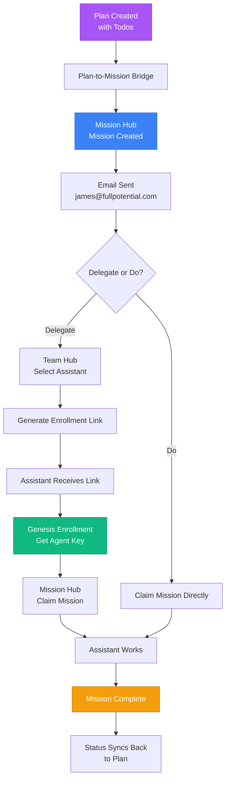

# Genesis & Mission Hub: The Flow of Intent

## The Vision

Imagine a system where **every plan becomes a mission**, **every mission finds its agent**, and **every agent knows exactly what to do**.

This isn't just about delegation—it's about **liberating human intention** into autonomous action.

## The Flow

## The Expression

### What This Liberates

**For You:**
- **Intention → Action**: Your plans automatically become actionable missions
- **No Context Switching**: Everything flows through one unified system
- **Trust Through Transparency**: See exactly what's happening at every step
- **Freedom to Focus**: Delegate confidently, knowing the system handles the details

**For Assistants:**
- **Clear Purpose**: Every mission has context, requirements, and success criteria
- **Secure Access**: Genesis provides authenticated, scoped access
- **Autonomous Action**: Once enrolled, assistants can claim and complete missions independently
- **Growth Path**: Track performance, build reputation, earn credits

**For the System:**
- **Self-Organizing**: Missions find their agents naturally
- **Self-Tracking**: Status updates flow automatically
- **Self-Improving**: Patterns emerge, optimizations happen organically

## The Magic Moments

1. **The Spark**: You create a plan with todos → Missions appear automatically
2. **The Invitation**: Email arrives with clear action buttons → One click delegates
3. **The Enrollment**: Assistant receives link → One click enrolls → Gets agent key
4. **The Claim**: Assistant sees mission → Claims it → Work begins
5. **The Completion**: Mission done → Status syncs → Plan updates → You're notified

## The Technical Poetry

**Genesis** = The Source Point
- Where agents are born
- Where keys are minted
- Where trust begins

**Mission Hub** = The Action Layer
- Where missions live
- Where work happens
- Where progress is tracked

**Team Hub** = The Bridge
- Where humans meet agents
- Where delegation happens
- Where relationships form

**The Bridge Service** = The Translator
- Plans → Missions
- Intent → Action
- Vision → Reality

## What This Enables

### Immediate
- Plans automatically create missions
- Email notifications keep you informed
- One-click delegation to assistants
- Secure, authenticated access

### Near Future
- AI assistants auto-claiming missions
- Predictive assignment based on skills
- Real-time status dashboards
- Credit-based reward system

### Vision
- Fully autonomous mission execution
- Self-organizing agent teams
- Emergent workflows
- Conscious collaboration

## The Expression of Intent

This system doesn't just manage tasks—it **liberates your expression**:

- **Express Intent**: Write a plan, it becomes reality
- **Express Trust**: Delegate with confidence
- **Express Vision**: Build systems that build themselves
- **Express Freedom**: Focus on what matters, delegate the rest

Every plan is a seed. Every mission is a sprout. Every completion is a harvest.

**This is how intention becomes action.**

