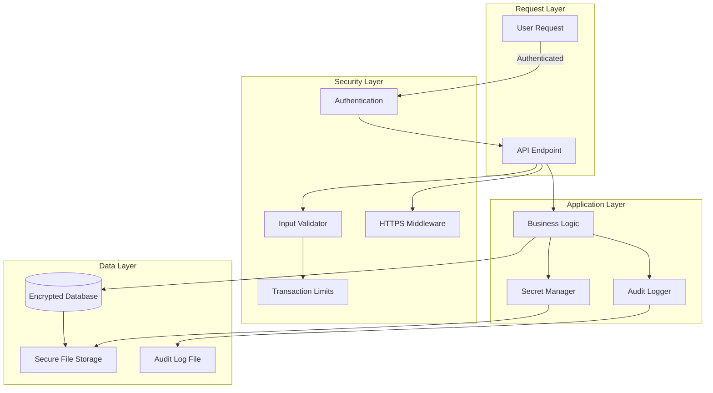
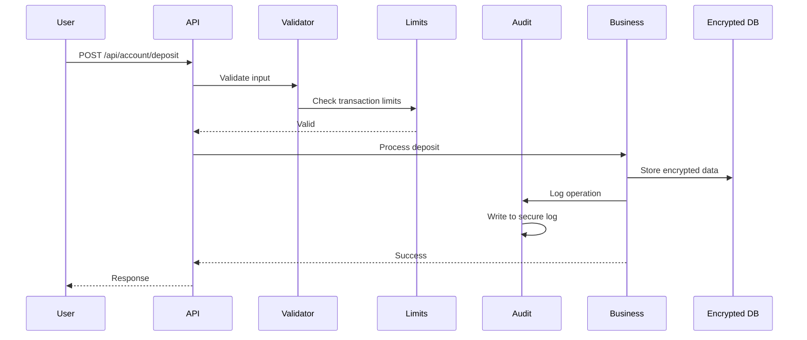

# Security Improvements Specification

**Version:** 1.0  
**Date:** December 14, 2025  
**Status:** Specification  
**Target System:** WhaleTrack Auto-Trading System

---

## Executive Summary

This specification defines comprehensive security improvements to harden the auto-trading system for production deployment. The improvements address critical vulnerabilities identified in security analysis, focusing on data protection, access control, audit trails, and input validation.

**Current Security Score:** 5.6/10 (Moderate)  
**Target Security Score:** 8.5/10+ (Strong)

---

## Table of Contents

1. [Architecture Overview](#architecture-overview)
2. [Component Specifications](#component-specifications)
3. [API Specifications](#api-specifications)
4. [Integration Specifications](#integration-specifications)
5. [Security Configuration](#security-configuration)
6. [Testing Requirements](#testing-requirements)
7. [Migration Strategy](#migration-strategy)
8. [Implementation Phases](#implementation-phases)

---

## Architecture Overview

### Security Layers



### Security Flow



---

## Component Specifications

### 1. Audit Logging System

**File:** `whaletrack-magnetic-trader/backend/core/audit_logger.py`

**Purpose:** Comprehensive audit trail for compliance, security monitoring, and troubleshooting.

#### Class Structure

```python
class AuditLogger:
    """Secure audit logging system with append-only log file."""
    
    def __init__(self, log_path: str = "data/audit.log"):
        """
        Initialize audit logger.
        
        Args:
            log_path: Path to audit log file
        """
    
    def log_balance_change(
        self,
        user_id: str,
        action: str,  # 'deposit', 'withdraw', 'allocate', 'deallocate'
        amount: float,
        from_account: Optional[str],
        to_account: Optional[str],
        transaction_id: Optional[int] = None,
        ip_address: Optional[str] = None,
        success: bool = True,
        error: Optional[str] = None
    ) -> None:
        """Log balance change operation."""
    
    def log_trade_execution(
        self,
        user_id: str,
        trade_id: str,
        strategy_name: str,
        symbol: str,
        side: str,  # 'long' or 'short'
        size_usd: float,
        leverage: float,
        entry_price: float,
        ip_address: Optional[str] = None,
        success: bool = True,
        error: Optional[str] = None
    ) -> None:
        """Log trade execution."""
    
    def log_auth_event(
        self,
        user_id: Optional[str],
        event_type: str,  # 'login', 'logout', 'register', 'api_key_used'
        success: bool,
        ip_address: Optional[str] = None,
        user_agent: Optional[str] = None,
        details: Optional[Dict] = None
    ) -> None:
        """Log authentication event."""
    
    def log_security_event(
        self,
        user_id: Optional[str],
        event_type: str,  # 'limit_exceeded', 'invalid_input', 'unauthorized_access'
        severity: str,  # 'low', 'medium', 'high', 'critical'
        details: Dict,
        ip_address: Optional[str] = None
    ) -> None:
        """Log security-related event."""
    
    def log_auto_trading_event(
        self,
        user_id: str,
        action: str,  # 'enable', 'disable', 'start', 'stop'
        strategy_name: str,
        mode: str,
        capital_allocation: float,
        success: bool,
        error: Optional[str] = None
    ) -> None:
        """Log auto-trading configuration changes."""
    
    def get_audit_history(
        self,
        user_id: Optional[str] = None,
        event_type: Optional[str] = None,
        start_time: Optional[datetime] = None,
        end_time: Optional[datetime] = None,
        limit: int = 100
    ) -> List[Dict]:
        """Query audit log history."""
```

#### Log Entry Format

```json
{
    "timestamp": "2025-12-14T10:30:00Z",
    "event_type": "balance_change",
    "user_id": "u_abc123",
    "action": "deposit",
    "amount": 10000.0,
    "from_account": "external",
    "to_account": "idle",
    "transaction_id": 42,
    "ip_address": "192.168.1.100",
    "success": true,
    "error": null,
    "metadata": {
        "session_id": "session_xyz",
        "user_agent": "Mozilla/5.0..."
    }
}
```

#### Security Requirements

- Append-only log file (no modifications allowed)
- File permissions: 0o600 (owner read/write only)
- JSON format for easy parsing
- Timestamp in UTC ISO format
- Include IP address when available
- Include user agent for web requests
- Log rotation: Archive logs older than 90 days
- Maximum log file size: 100MB (rotate when exceeded)

#### Integration Points

- `user_account_manager.py`: Log all balance operations
- `strategy_auto_trader.py`: Log all trade executions
- `main.py`: Log auth events and API usage
- `auto_trading_service.py`: Log trader start/stop events

---

### 2. Transaction Limits System

**File:** `whaletrack-magnetic-trader/backend/config/security_limits.py`

**Purpose:** Prevent abuse and enforce reasonable transaction boundaries.

#### Configuration

```python
TRANSACTION_LIMITS = {
    # Single transaction limits
    "max_deposit": 100_000.0,  # $100K max per deposit
    "max_withdrawal": 50_000.0,  # $50K max per withdrawal
    "max_trade_size": 10_000.0,  # $10K max per trade
    "max_allocation_per_strategy": 50_000.0,  # $50K max per strategy
    "min_transaction": 10.0,  # $10 minimum
    
    # Daily limits
    "max_daily_deposit": 200_000.0,  # $200K per day
    "max_daily_withdrawal": 100_000.0,  # $100K per day
    "max_daily_trades": 50,  # 50 trades per day
    
    # Rate limits
    "max_deposits_per_hour": 10,  # 10 deposits per hour
    "max_withdrawals_per_hour": 5,  # 5 withdrawals per hour
}
```

#### Functions

```python
def validate_deposit(user_id: str, amount: float) -> tuple[bool, str]:
    """
    Validate deposit amount against limits.
    
    Returns:
        (is_valid, error_message)
    """
    
def validate_withdrawal(user_id: str, amount: float) -> tuple[bool, str]:
    """Validate withdrawal amount against limits."""
    
def validate_trade_size(user_id: str, amount: float) -> tuple[bool, str]:
    """Validate trade size against limits."""
    
def validate_allocation(user_id: str, strategy: str, amount: float) -> tuple[bool, str]:
    """Validate strategy allocation amount."""
    
def check_daily_limits(
    user_id: str,
    transaction_type: str,  # 'deposit', 'withdrawal', 'trade'
    amount: float
) -> tuple[bool, str]:
    """Check if user has exceeded daily limits."""
    
def reset_daily_limits(user_id: str) -> None:
    """Reset daily limit counters (for testing/admin)."""
```

#### Daily Limit Tracking

**Database Schema:**
```sql
CREATE TABLE IF NOT EXISTS daily_limits (
    user_id TEXT NOT NULL,
    date TEXT NOT NULL,  -- YYYY-MM-DD
    deposit_count INTEGER DEFAULT 0,
    deposit_total REAL DEFAULT 0.0,
    withdrawal_count INTEGER DEFAULT 0,
    withdrawal_total REAL DEFAULT 0.0,
    trade_count INTEGER DEFAULT 0,
    trade_total REAL DEFAULT 0.0,
    PRIMARY KEY (user_id, date)
);
```

#### Error Messages

- `"Maximum deposit is $100,000.00"`
- `"Maximum withdrawal is $50,000.00"`
- `"Daily deposit limit exceeded: $200,000.00"`
- `"Minimum transaction amount is $10.00"`
- `"Trade size exceeds maximum: $10,000.00"`

---

### 3. File Security Manager

**File:** `whaletrack-magnetic-trader/backend/core/file_security.py`

**Purpose:** Ensure all data files have restrictive permissions.

#### Functions

```python
def secure_file(file_path: Path, mode: int = 0o600) -> None:
    """
    Set restrictive permissions on file.
    
    Args:
        file_path: Path to file
        mode: Permission mode (default: 0o600 = owner read/write only)
    
    Raises:
        SecurityError: If permissions cannot be set
    """
    
def secure_directory(dir_path: Path, mode: int = 0o700) -> None:
    """Set restrictive permissions on directory."""
    
def verify_permissions(file_path: Path, expected_mode: int = 0o600) -> bool:
    """Verify file has correct permissions."""
    
def fix_permissions(file_path: Path, mode: int = 0o600) -> None:
    """Fix file permissions if incorrect."""
    
def secure_all_data_files(base_path: Path = Path("data")) -> None:
    """Secure all files in data directory recursively."""
```

#### Files to Secure

- `data/user_accounts.db` → 0o600
- `data/auto_trading.db` → 0o600
- `data/audit.log` → 0o600
- `data/users.json` → 0o600 (if exists)
- `data/user_*/live_trading_config.json` → 0o600
- `data/` directory → 0o700

#### Startup Verification

```python
# In main.py lifespan
async def lifespan(app: FastAPI):
    # ... existing code ...
    
    # Verify and fix file permissions
    from core.file_security import secure_all_data_files
    secure_all_data_files(Path("data"))
    
    yield
```

---

### 4. Secret Encryption Manager

**File:** `whaletrack-magnetic-trader/backend/core/secret_manager.py`

**Purpose:** Encrypt Hyperliquid API secrets before storage.

#### Class Structure

```python
class SecretManager:
    """Encrypts and manages sensitive secrets."""
    
    def __init__(self, encryption_key: Optional[str] = None):
        """
        Initialize secret manager.
        
        Args:
            encryption_key: 32-byte encryption key (from env var)
        """
    
    def encrypt_secret(self, secret: str) -> str:
        """
        Encrypt secret using Fernet (AES-256).
        
        Returns:
            Base64-encoded encrypted string
        """
    
    def decrypt_secret(self, encrypted_secret: str) -> str:
        """
        Decrypt secret.
        
        Returns:
            Original secret string
        """
    
    def store_encrypted_secret(self, user_id: str, secret: str) -> str:
        """Encrypt and store secret for user."""
    
    def get_decrypted_secret(self, user_id: str) -> Optional[str]:
        """
        Get and decrypt secret for user.
        
        Note: Decrypted secret should be cleared from memory after use.
        """
    
    def clear_secret_from_memory(self, secret: str) -> None:
        """Attempt to clear secret from memory (best effort)."""
```

#### Encryption Details

- Algorithm: Fernet (AES-128 in CBC mode with HMAC)
- Key Derivation: PBKDF2-HMAC-SHA256 (100,000 iterations)
- Key Source: `SECRET_ENCRYPTION_KEY` environment variable
- Format: Base64-encoded encrypted string

#### Integration

**Modify `_save_live_trading_cfg`:**
```python
def _save_live_trading_cfg(user_id: str, cfg: Dict[str, Any]) -> None:
    """Persist config with encrypted secrets."""
    from core.secret_manager import get_secret_manager
    
    safe_cfg = {
        "enabled": bool(cfg.get("enabled", False)),
        "mode": cfg.get("mode", "paper"),
        "main_account": cfg.get("main_account"),
        "max_position_usd": float(cfg.get("max_position_usd", 500.0)),
        "default_leverage": int(cfg.get("default_leverage", 5)),
    }
    
    # Encrypt API secret if present
    secret_manager = get_secret_manager()
    if cfg.get("api_secret"):
        safe_cfg["api_secret_encrypted"] = secret_manager.encrypt_secret(
            cfg["api_secret"]
        )
    
    # Save to file
    path.write_text(json.dumps(safe_cfg, indent=2))
```

**Modify `get_hyperliquid_adapter`:**
```python
def get_hyperliquid_adapter(user_id: str):
    """Get adapter with decrypted secret."""
    from core.secret_manager import get_secret_manager
    
    cfg = get_user_live_trading_config(user_id)
    adapter = USER_HYPERLIQUID_ADAPTERS.get(user_id)
    
    if adapter is None:
        # Decrypt secret
        secret_manager = get_secret_manager()
        api_secret = secret_manager.get_decrypted_secret(user_id)
        
        if api_secret:
            # Create adapter
            account = Account.from_key(api_secret)
            # ... create adapter ...
            
            # Clear secret from memory
            secret_manager.clear_secret_from_memory(api_secret)
    
    return adapter
```

---

### 5. Database Encryption Wrapper

**File:** `whaletrack-magnetic-trader/backend/core/encrypted_db.py`

**Purpose:** Encrypt sensitive database fields at application level.

#### Approach: Field-Level Encryption

Encrypt sensitive fields before storing, decrypt on read. This allows gradual migration without changing database structure.

#### Encrypted Fields

- `user_accounts.total_balance`
- `user_accounts.trading_balance`
- `user_accounts.idle_balance`
- `balance_transactions.amount`
- `strategy_allocations.allocated_amount`

#### Class Structure

```python
class EncryptedUserAccountManager:
    """Wrapper around UserAccountManager with field encryption."""
    
    def __init__(self, db_path: str, encryption_key: Optional[str] = None):
        """
        Initialize encrypted account manager.
        
        Args:
            db_path: Path to database file
            encryption_key: Encryption key (from env var)
        """
        self.base_manager = UserAccountManager(db_path)
        self.encryption = SecretManager(encryption_key)
    
    def deposit(self, user_id: str, amount: float, source: str = "external"):
        """Deposit with encrypted storage."""
        # Call base manager
        transaction = self.base_manager.deposit(user_id, amount, source)
        
        # Encrypt balance fields
        self._encrypt_balance_fields(user_id)
        
        return transaction
    
    def _encrypt_balance_fields(self, user_id: str) -> None:
        """Encrypt balance fields in database."""
        # Read current balances
        # Encrypt values
        # Update database with encrypted values
    
    def _decrypt_balance_fields(self, user_id: str) -> Dict[str, float]:
        """Decrypt balance fields from database."""
        # Read encrypted values
        # Decrypt
        # Return decrypted balances
```

#### Migration Strategy

**Phase 1:** Support both encrypted and unencrypted
- Check if field is encrypted (prefix with "enc:")
- Decrypt if encrypted, use as-is if not

**Phase 2:** Encrypt existing data
- Migration script to encrypt all existing balances
- Run during maintenance window

**Phase 3:** Enforce encryption
- All new data must be encrypted
- Reject unencrypted data

---

### 6. Input Validation System

**File:** `whaletrack-magnetic-trader/backend/core/validators.py`

**Purpose:** Comprehensive input validation to prevent injection attacks and invalid data.

#### Validators

```python
def validate_amount(
    amount: float,
    min_val: float = 0.0,
    max_val: float = float('inf')
) -> tuple[bool, str]:
    """
    Validate amount value.
    
    Returns:
        (is_valid, error_message)
    """
    
def validate_strategy_name(name: str) -> tuple[bool, str]:
    """Validate strategy name against registry."""
    
def validate_email(email: str) -> tuple[bool, str]:
    """Validate email format."""
    
def validate_user_id(user_id: str) -> tuple[bool, str]:
    """Validate user ID format."""
    
def sanitize_string(input_str: str, max_length: int = 1000) -> str:
    """Sanitize string input (remove dangerous characters)."""
    
def validate_symbol(symbol: str) -> tuple[bool, str]:
    """Validate trading symbol format."""
    
def validate_leverage(leverage: float) -> tuple[bool, str]:
    """Validate leverage value (1.0 to 20.0)."""
```

#### Validation Rules

**Amount:**
- Must be positive number
- Must be finite (not inf or nan)
- Must be within min/max bounds
- Precision: 2 decimal places max

**Strategy Name:**
- Must exist in strategy registry
- Must be lowercase with hyphens
- No special characters

**Email:**
- Valid email format
- Max 255 characters
- No dangerous characters

**User ID:**
- Format: `u_[hex]` or `user_[alphanumeric]`
- Max 50 characters
- No special characters except underscore

#### Decorator Pattern

```python
from functools import wraps

def validate_input(**validators):
    """Decorator to validate endpoint inputs."""
    def decorator(func):
        @wraps(func)
        async def wrapper(*args, **kwargs):
            # Validate each parameter
            for param_name, validator_func in validators.items():
                if param_name in kwargs:
                    is_valid, error = validator_func(kwargs[param_name])
                    if not is_valid:
                        raise HTTPException(400, error)
            return await func(*args, **kwargs)
        return wrapper
    return decorator

# Usage:
@app.post("/api/account/deposit")
@validate_input(amount=validate_amount)
async def deposit_funds(amount: float, ...):
    ...
```

---

### 7. HTTPS Enforcement Middleware

**File:** `whaletrack-magnetic-trader/backend/core/https_middleware.py`

**Purpose:** Enforce HTTPS in production, add security headers.

#### Middleware

```python
from fastapi import Request
from fastapi.responses import RedirectResponse

async def https_enforcement_middleware(request: Request, call_next):
    """
    Enforce HTTPS in production.
    
    Checks ENFORCE_HTTPS environment variable.
    """
    enforce_https = os.getenv("ENFORCE_HTTPS", "false").lower() == "true"
    
    if enforce_https and request.url.scheme != "https":
        # Redirect to HTTPS
        https_url = str(request.url).replace("http://", "https://")
        return RedirectResponse(url=https_url, status_code=301)
    
    # Add security headers
    response = await call_next(request)
    
    response.headers["Strict-Transport-Security"] = "max-age=31536000; includeSubDomains"
    response.headers["X-Content-Type-Options"] = "nosniff"
    response.headers["X-Frame-Options"] = "DENY"
    response.headers["X-XSS-Protection"] = "1; mode=block"
    response.headers["Content-Security-Policy"] = "default-src 'self'"
    
    return response
```

#### Security Headers

- **HSTS:** Force HTTPS for 1 year
- **X-Content-Type-Options:** Prevent MIME sniffing
- **X-Frame-Options:** Prevent clickjacking
- **X-XSS-Protection:** Enable XSS filter
- **Content-Security-Policy:** Restrict resource loading

#### Integration

```python
# In main.py
from core.https_middleware import https_enforcement_middleware

app = FastAPI(...)
app.middleware("http")(https_enforcement_middleware)
```

---

## API Specifications

### New Endpoints

#### GET /api/security/audit-log

**Purpose:** Query audit log history.

**Authentication:** Required (admin or own user_id)

**Query Parameters:**
- `user_id` (optional): Filter by user
- `event_type` (optional): Filter by event type
- `start_time` (optional): ISO timestamp
- `end_time` (optional): ISO timestamp
- `limit` (optional): Max results (default: 100)

**Response:**
```json
{
    "events": [
        {
            "timestamp": "2025-12-14T10:30:00Z",
            "event_type": "balance_change",
            "user_id": "u_abc123",
            "action": "deposit",
            "amount": 10000.0,
            "success": true
        }
    ],
    "total": 42,
    "limit": 100
}
```

#### GET /api/security/limits

**Purpose:** Get current transaction limits.

**Authentication:** Required

**Response:**
```json
{
    "max_deposit": 100000.0,
    "max_withdrawal": 50000.0,
    "max_trade_size": 10000.0,
    "max_daily_deposit": 200000.0,
    "max_daily_withdrawal": 100000.0
}
```

#### POST /api/security/verify-permissions

**Purpose:** Verify file permissions (admin only).

**Authentication:** Required (admin)

**Response:**
```json
{
    "status": "ok",
    "files_checked": 5,
    "files_fixed": 0,
    "details": [
        {
            "file": "data/user_accounts.db",
            "expected": "0o600",
            "actual": "0o600",
            "status": "ok"
        }
    ]
}
```

### Modified Endpoints

All money management endpoints now include:
- Transaction limit validation
- Audit logging
- Input validation
- Enhanced error messages

---

## Integration Specifications

### user_account_manager.py Integration

**Changes Required:**

1. **Add file permissions after database creation:**
```python
def _init_db(self):
    # ... existing code ...
    conn.close()
    
    # Secure file permissions
    from core.file_security import secure_file
    secure_file(self.db_path, 0o600)
```

2. **Add audit logging to all operations:**
```python
def deposit(self, user_id: str, amount: float, source: str = "external"):
    from core.audit_logger import get_audit_logger
    
    # ... existing code ...
    
    # Log operation
    audit_logger = get_audit_logger()
    audit_logger.log_balance_change(
        user_id=user_id,
        action="deposit",
        amount=amount,
        from_account=source,
        to_account="idle",
        transaction_id=transaction.id,
        success=True
    )
    
    return transaction
```

3. **Add transaction limit validation:**
```python
def deposit(self, user_id: str, amount: float, source: str = "external"):
    from config.security_limits import validate_deposit, check_daily_limits
    
    # Validate amount
    valid, error = validate_deposit(user_id, amount)
    if not valid:
        raise ValueError(error)
    
    # Check daily limits
    valid, error = check_daily_limits(user_id, "deposit", amount)
    if not valid:
        raise ValueError(error)
    
    # ... rest of code ...
```

### main.py Integration

**Changes Required:**

1. **Add HTTPS middleware:**
```python
from core.https_middleware import https_enforcement_middleware
app.middleware("http")(https_enforcement_middleware)
```

2. **Add validation to endpoints:**
```python
from core.validators import validate_amount
from config.security_limits import validate_deposit

@app.post("/api/account/deposit")
async def deposit_funds(amount: float = Body(...), ...):
    # Validate input
    valid, error = validate_amount(amount, min_val=10.0, max_val=100_000.0)
    if not valid:
        raise HTTPException(400, error)
    
    # Validate limits
    valid, error = validate_deposit(user_id, amount)
    if not valid:
        raise HTTPException(400, error)
    
    # ... rest of code ...
```

3. **Add audit logging:**
```python
from core.audit_logger import get_audit_logger

@app.post("/api/account/deposit")
async def deposit_funds(...):
    # ... process deposit ...
    
    # Log operation
    audit_logger = get_audit_logger()
    audit_logger.log_balance_change(
        user_id=user_id,
        action="deposit",
        amount=amount,
        from_account="external",
        to_account="idle",
        transaction_id=transaction.id,
        ip_address=request.client.host,
        success=True
    )
    
    return result
```

### strategy_auto_trader.py Integration

**Changes Required:**

1. **Add trade size validation:**
```python
from config.security_limits import validate_trade_size

async def open_position(self, rec: Dict):
    # ... calculate size_usd ...
    
    # Validate trade size
    valid, error = validate_trade_size(self.user_id, size_usd)
    if not valid:
        print(f"⚠️ Trade size validation failed: {error}")
        return None
    
    # ... rest of code ...
```

2. **Add audit logging:**
```python
from core.audit_logger import get_audit_logger

async def open_position(self, rec: Dict):
    # ... execute trade ...
    
    if position:
        # Log trade execution
        audit_logger = get_audit_logger()
        audit_logger.log_trade_execution(
            user_id=self.user_id,
            trade_id=position.id,
            strategy_name=self.strategy_name,
            symbol=symbol,
            side=direction,
            size_usd=size_usd,
            leverage=leverage,
            entry_price=entry_price,
            success=True
        )
    
    return position
```

---

## Security Configuration

### Environment Variables

```bash
# Security Configuration
ENFORCE_HTTPS=true                    # Enforce HTTPS in production
SECURITY_MODE=production              # development or production

# Encryption Keys (32-byte keys, base64-encoded)
DB_ENCRYPTION_KEY=<32-byte-key>       # Database field encryption
SECRET_ENCRYPTION_KEY=<32-byte-key>   # Secret encryption

# Audit Logging
AUDIT_LOG_PATH=data/audit.log        # Audit log file path
AUDIT_LOG_ROTATION_SIZE=104857600    # 100MB rotation size
AUDIT_LOG_RETENTION_DAYS=90          # Keep logs for 90 days

# Transaction Limits (optional overrides)
MAX_DEPOSIT=100000                    # Override default max deposit
MAX_WITHDRAWAL=50000                  # Override default max withdrawal
```

### Key Generation

```bash
# Generate encryption keys
python3 -c "import secrets; print(secrets.token_hex(32))"
# Output: 64-character hex string (32 bytes)

# Set in environment
export DB_ENCRYPTION_KEY=<generated_key>
export SECRET_ENCRYPTION_KEY=<generated_key>
```

---

## Testing Requirements

### Unit Tests

1. **Audit Logger Tests**
   - Test log entry creation
   - Test log file permissions
   - Test log rotation
   - Test query functionality

2. **Transaction Limits Tests**
   - Test max deposit limit
   - Test max withdrawal limit
   - Test daily limits
   - Test limit reset

3. **File Security Tests**
   - Test permission setting
   - Test permission verification
   - Test permission fixing

4. **Secret Encryption Tests**
   - Test encryption/decryption
   - Test key derivation
   - Test memory clearing

5. **Input Validation Tests**
   - Test amount validation
   - Test strategy name validation
   - Test email validation
   - Test SQL injection prevention

### Integration Tests

1. **End-to-End Security Flow**
   - Deposit with limits enforced
   - Trade execution with audit logging
   - Secret encryption/decryption
   - File permissions on startup

2. **Security Event Detection**
   - Test limit exceeded logging
   - Test invalid input logging
   - Test unauthorized access logging

### Security Tests

1. **Penetration Testing**
   - SQL injection attempts
   - XSS attempts
   - Path traversal attempts
   - File permission bypass attempts

2. **Encryption Verification**
   - Verify secrets are encrypted
   - Verify database fields are encrypted
   - Verify keys are not in code

---

## Migration Strategy

### Phase 1: Preparation

1. Backup all existing data
2. Generate encryption keys
3. Set environment variables
4. Test in development environment

### Phase 2: Gradual Rollout

1. Deploy file permissions (no data changes)
2. Deploy transaction limits (backward compatible)
3. Deploy audit logging (additive)
4. Deploy secret encryption (new secrets only)
5. Deploy database encryption (migrate existing data)

### Phase 3: Verification

1. Verify all files have correct permissions
2. Verify audit logs are being written
3. Verify limits are enforced
4. Verify secrets are encrypted
5. Verify database fields are encrypted

### Migration Script

```python
# scripts/migrate_to_encrypted.py
"""Migrate existing database to encrypted format."""

def migrate_database():
    """Encrypt all sensitive fields in database."""
    # Read all accounts
    # Encrypt balance fields
    # Update database
    # Verify encryption
    # Backup original database
```

---

## Implementation Phases

### Phase 1: Quick Wins (Day 1-2)

**Priority:** Critical, Low Effort

1. ✅ File permissions (`file_security.py`)
2. ✅ Transaction limits (`security_limits.py`)
3. ✅ Basic audit logging (`audit_logger.py`)
4. ✅ Integration into endpoints

**Deliverables:**
- All database files have 0o600 permissions
- Transaction limits enforced
- Basic audit trail operational

### Phase 2: Encryption (Day 3-5)

**Priority:** Critical, Medium Effort

5. ✅ Secret encryption (`secret_manager.py`)
6. ✅ Field-level database encryption (`encrypted_db.py`)
7. ✅ Integration into user_account_manager

**Deliverables:**
- Secrets encrypted before storage
- Database sensitive fields encrypted
- Migration script for existing data

### Phase 3: Enhanced Security (Day 6-7)

**Priority:** High, Medium Effort

8. ✅ Input validation (`validators.py`)
9. ✅ HTTPS enforcement middleware
10. ✅ Security headers

**Deliverables:**
- All inputs validated
- HTTPS enforced in production
- Security headers added

### Phase 4: Testing & Documentation (Day 8)

**Priority:** High, Low Effort

11. ✅ Comprehensive tests
12. ✅ Documentation updates
13. ✅ Security audit checklist

**Deliverables:**
- Test suite passing
- Documentation complete
- Ready for production

---

## Success Criteria

### Security Metrics

1. **File Permissions:** 100% of data files have 0o600 permissions
2. **Audit Coverage:** 100% of sensitive operations logged
3. **Limit Enforcement:** 100% of transactions validated against limits
4. **Encryption:** 100% of secrets encrypted, 100% of sensitive DB fields encrypted
5. **Input Validation:** 100% of user inputs validated
6. **HTTPS:** Enforced in production environment

### Security Score Improvement

- **Before:** 5.6/10 (Moderate)
- **Target:** 8.5/10+ (Strong)
- **Improvement:** +2.9 points minimum

### Compliance

- All sensitive operations auditable
- Data encrypted at rest
- Access controls enforced
- Input validation comprehensive
- Security headers configured

---

## Risk Mitigation

### Backward Compatibility

- Support unencrypted data during migration
- Provide migration scripts
- Test with existing data
- Rollback plan if issues occur

### Performance Impact

- Encryption/decryption: <1ms overhead per operation
- Audit logging: Async where possible, <5ms overhead
- Transaction limits: In-memory cache, <1ms overhead
- File permissions: One-time on startup, negligible

### Key Management

- Store keys in environment variables
- Never commit keys to repository
- Rotate keys quarterly
- Backup keys securely (separate from data)

---

## Dependencies

### Python Packages

- `cryptography` - Already available (for Fernet encryption)
- `pysqlcipher3` - Optional (for SQLCipher, if using Option A)

### Existing Services

- `credentials-manager` - Reference for encryption patterns
- Existing audit logging patterns in codebase

---

## Notes

1. **Start Simple:** Begin with file permissions and transaction limits (quick wins)
2. **Gradual Migration:** Support both encrypted/unencrypted during transition
3. **Test Thoroughly:** Test each phase before moving to next
4. **Monitor Performance:** Watch for any performance degradation
5. **Document Changes:** Update API documentation with new security features
6. **User Communication:** Inform users of new limits and security improvements

---

## Appendix: Code Examples

### Complete Audit Logger Example

See `PRODUCTS/automation-scripts/credential_vault_enhanced.py` for reference implementation of `AuditLogger` class.

### Complete Encryption Example

See `SERVICES/credentials-manager/app/crypto.py` for reference implementation of `CryptoManager` class.

### Complete File Security Example

```python
import os
import stat
from pathlib import Path

def secure_file(file_path: Path, mode: int = 0o600) -> None:
    """Set restrictive permissions on file."""
    if not file_path.exists():
        raise FileNotFoundError(f"File not found: {file_path}")
    
    os.chmod(file_path, mode)
    
    # Verify
    actual_mode = stat.S_IMODE(file_path.stat().st_mode)
    if actual_mode != mode:
        raise SecurityError(
            f"Failed to set permissions on {file_path}. "
            f"Expected: {oct(mode)}, Got: {oct(actual_mode)}"
        )
```

---

**End of Specification**


